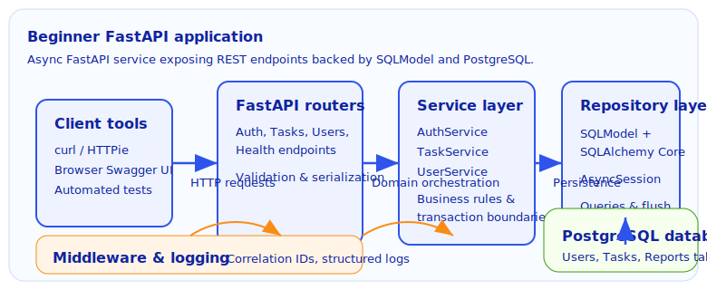
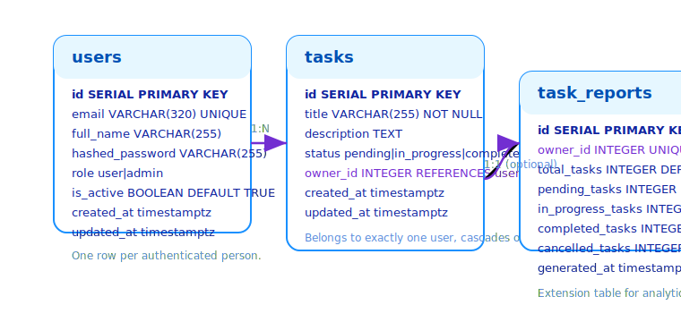

# Beginner FastAPI Project

> Hands-on introduction to building a token-authenticated task API with FastAPI, SQLModel, and PostgreSQL.

## Table of contents

- [1. Introduction](#1-introduction)
- [2. Setup & Getting Started](#2-setup--getting-started)
  - [2.1 Prerequisites](#21-prerequisites)
  - [2.2 Local Environment Setup](#22-local-environment-setup)
  - [2.3 Verification Checklist](#23-verification-checklist)
- [3. Architecture Overview](#3-architecture-overview)
  - [3.1 Component Breakdown](#31-component-breakdown)
  - [3.2 Request & Data Flow](#32-request--data-flow)
- [4. Database Schema](#4-database-schema)
- [5. Authentication Flow](#5-authentication-flow)
- [6. API Walkthrough & Examples](#6-api-walkthrough--examples)
  - [6.1 Sign up & log in](#61-sign-up--log-in)
  - [6.2 Working with tasks](#62-working-with-tasks)
  - [6.3 Refresh tokens & protected routes](#63-refresh-tokens--protected-routes)
- [7. Running automated tests](#7-running-automated-tests)
- [8. Troubleshooting](#8-troubleshooting)
- [9. Practice exercises](#9-practice-exercises)

---

## 1. Introduction

- **Purpose:** Provide a safe playground for new contributors to learn how we structure FastAPI services, enforce JWT-based authentication, and persist data with SQLModel.
- **Audience:** Engineers comfortable with basic Python who want a guided tour through the service stack before tackling larger features.
- **Status & owners:** Production-ready training project maintained by the Platform Enablement team (see [CONTRIBUTING.md](../../CONTRIBUTING.md) for collaboration norms).

## 2. Setup & Getting Started

### 2.1 Prerequisites

| Tool | Why it is needed | Suggested version |
| --- | --- | --- |
| Python | Runs application code and management tasks | 3.12.x |
| [Poetry](https://python-poetry.org/docs/#installation) | Dependency and virtual environment manager | 1.8+ |
| Docker Engine + Compose plugin | Provides PostgreSQL locally and an optional container image for the API | 24+ |
| `curl` and/or [HTTPie](https://httpie.io/cli) | Quick API experiments from the terminal | Latest |
| `jq` (optional) | Pretty-print JSON responses when using `curl` | Latest |

### 2.2 Local Environment Setup

Follow the steps below on a clean machine. Commands assume you are positioned at the repository root after cloning.

1. **Clone the repository and install dependencies.**

   ```bash
   git clone <repository-url>
   cd <repository-directory>
   poetry install
   poetry run pre-commit install
   ```

2. **Configure environment variables for the beginner project.**

   ```bash
   cp projects/01-beginner/.env.example projects/01-beginner/.env
   ```

   Update the generated `.env` file to customise secrets as needed. Replace placeholder keys before deploying anywhere other than local development:

   ```bash
   # Example: generate fresh secrets
   openssl rand -hex 32
   ```

3. **Start PostgreSQL using Docker Compose.** Only the database service is required for this project.

   ```bash
   docker compose up -d postgres
   docker compose ps
   ```

   Wait for the `postgres` service to report `healthy` before continuing.

4. **Apply database migrations.** Alembic is configured to discover the beginner app metadata automatically.

   ```bash
   poetry run alembic upgrade head
   ```

5. **(Optional but recommended) Seed demo data.**

   ```bash
   poetry run python -m projects.01-beginner.app.db.seed
   ```

6. **Run the API locally.** This uses the Poetry script declared in `pyproject.toml` and honours values from `projects/01-beginner/.env`.

   ```bash
   poetry run beginner-app
   ```

   The server listens on `http://localhost:8002` by default. Leave this process running in a terminal while you explore the endpoints.

### 2.3 Verification Checklist

Perform the following quick checks to confirm the stack is working end-to-end:

```bash
# Health check should return {"status": "ok"}
curl http://localhost:8002/health | python -m json.tool

# Authenticate with the seeded demo account (see step 5)
LOGIN_RESPONSE=$(curl -s -X POST http://localhost:8002/api/auth/login \
  -H "Content-Type: application/x-www-form-urlencoded" \
  -d "username=demo@example.com&password=demo-password")

echo "$LOGIN_RESPONSE" | python -m json.tool
```

Copy the `access_token` from the formatted output above and use it in the next command to confirm you can talk to the task endpoints:

```bash
curl -s http://localhost:8002/api/tasks \
  -H "Authorization: Bearer <paste-access-token-here>" \
  | python -m json.tool
```

If you have [`jq`](https://stedolan.github.io/jq/) installed you can automate the extraction:

```bash
ACCESS_TOKEN=$(echo "$LOGIN_RESPONSE" | jq -r '.tokens.access_token')
curl -s http://localhost:8002/api/tasks \
  -H "Authorization: Bearer ${ACCESS_TOKEN}" \
  | python -m json.tool
```

If you prefer running the API inside Docker, build and start the dedicated service:

```bash
docker compose up -d --build beginner-app
```

The Compose variant will automatically install dependencies and reload on code changes.

## 3. Architecture Overview

The beginner project is a layered FastAPI application. Routers focus on HTTP concerns, services encapsulate business logic, repositories manage persistence, and SQLModel provides declarative models over PostgreSQL.



### 3.1 Component Breakdown

| Component | Responsibility | Technology | Notes |
| --- | --- | --- | --- |
| FastAPI routers | Define `/api/auth`, `/api/tasks`, `/api/users`, and `/health` endpoints | FastAPI, Pydantic v2 | Input validation, response models, dependency wiring |
| Service layer | Orchestrates authentication, task workflows, and user management | Python services (`AuthService`, `TaskService`, `UserService`) | Owns transactions and guards domain invariants |
| Repository layer | Encapsulates SQL queries and entity persistence | SQLModel, SQLAlchemy Core | Exposes async methods for CRUD and filtered queries |
| Database | Persists users, tasks, and aggregate reports | PostgreSQL 16 | Managed via Alembic migrations |
| Middleware & logging | Adds correlation IDs, structured logs, and error envelopes | Starlette middleware, Python logging | Ensures every request has a traceable `X-Request-ID` |

### 3.2 Request & Data Flow

1. A client sends an HTTP request (e.g. `POST /api/auth/login`).
2. FastAPI resolves dependencies: settings, database session, authenticated user, etc.
3. Business logic executes in the appropriate service (authentication, task updates, validations).
4. Repositories issue async SQL queries via a shared `AsyncSession`.
5. Responses are serialised with Pydantic models. Errors are normalised by central handlers in `app/errors.py`.
6. Middleware injects a correlation ID into logs and responses for observability.

## 4. Database Schema

Three tables back the beginner project: `users`, `tasks`, and an optional `task_reports` aggregate used for analytics exercises. SQLModel defines the ORM models while Alembic manages migrations.



Key relationships:

- Each task belongs to exactly one user (`tasks.owner_id → users.id`).
- Deleting a user cascades to their tasks and reports.
- Task status is constrained to one of `pending`, `in_progress`, `completed`, or `cancelled` via an enumerated type.

Use `poetry run alembic history` to view all migrations and `poetry run alembic downgrade -1` to roll back the latest change if needed during experiments.

## 5. Authentication Flow

Authentication is token-based and relies on signed JWTs:

1. **Sign up** – `POST /api/auth/signup` stores a user with a hashed password and immediately returns access + refresh tokens.
2. **Log in** – `POST /api/auth/login` accepts form-encoded credentials and issues a new token pair.
3. **Authorise requests** – Include `Authorization: Bearer <access-token>` when calling protected endpoints. Access tokens expire after `BEGINNER_ACCESS_TOKEN_EXPIRE_MINUTES` (default 30 minutes).
4. **Refresh** – `POST /api/auth/refresh` exchanges a refresh token for a new pair and blacklists the previous refresh token.
5. **Role checks** – `AdminUserDependency` restricts certain endpoints (e.g. `/api/users/admin`) to the `admin` role.
6. **Revocation** – Refresh tokens are single-use. Attempts to reuse a token return `401` with `Refresh token has been revoked.`

Rotate `BEGINNER_JWT_SECRET_KEY` and `BEGINNER_JWT_REFRESH_SECRET_KEY` for production environments and keep them private.

## 6. API Walkthrough & Examples

All endpoints are namespaced under the API prefix defined in settings (`/api` by default). Replace the example credentials or IDs with the values created during your session.

### 6.1 Sign up & log in

```bash
# Sign up a new user with curl
curl -X POST http://localhost:8002/api/auth/signup \
  -H "Content-Type: application/json" \
  -d '{"email":"jane@example.com","password":"StrongPass123!","full_name":"Jane Example"}' \
  | python -m json.tool

# Equivalent HTTPie request
http POST :8002/api/auth/signup \
  email=jane@example.com password=StrongPass123! full_name="Jane Example"
```

Store the issued tokens for later commands:

```bash
# Extract tokens with jq (optional but convenient)
ACCESS_TOKEN=$(curl -s -X POST http://localhost:8002/api/auth/login \
  -H "Content-Type: application/x-www-form-urlencoded" \
  -d "username=jane@example.com&password=StrongPass123!" | jq -r '.tokens.access_token')
REFRESH_TOKEN=$(curl -s -X POST http://localhost:8002/api/auth/login \
  -H "Content-Type: application/x-www-form-urlencoded" \
  -d "username=jane@example.com&password=StrongPass123!" | jq -r '.tokens.refresh_token')
```

### 6.2 Working with tasks

```bash
# Create a task
curl -X POST http://localhost:8002/api/tasks \
  -H "Authorization: Bearer ${ACCESS_TOKEN}" \
  -H "Content-Type: application/json" \
  -d '{"title": "Write onboarding checklist", "description": "Outline day-one tasks."}' \
  | python -m json.tool

# List tasks with pagination filters (HTTPie example)
http GET :8002/api/tasks \
  "Authorization:Bearer ${ACCESS_TOKEN}" limit==10 status==in_progress

# Update the task status
curl -X PATCH http://localhost:8002/api/tasks/1 \
  -H "Authorization: Bearer ${ACCESS_TOKEN}" \
  -H "Content-Type: application/json" \
  -d '{"status": "completed"}' \
  | python -m json.tool

# Delete a task
http DELETE :8002/api/tasks/1 "Authorization:Bearer ${ACCESS_TOKEN}"
```

Remember that non-admin users can only see and modify their own tasks. Admins (role `admin`) may pass `owner_id=<user-id>` to inspect other users' work queues.

### 6.3 Refresh tokens & protected routes

```bash
# Refresh tokens (single-use)
http POST :8002/api/auth/refresh refresh_token=${REFRESH_TOKEN}

# Access a protected profile route
curl http://localhost:8002/api/users/me \
  -H "Authorization: Bearer ${ACCESS_TOKEN}" \
  | python -m json.tool

# Demonstrate admin-only access
http GET :8002/api/users/admin "Authorization:Bearer ${ADMIN_ACCESS_TOKEN}"
```

Use `/docs` or `/redoc` for interactive API exploration. Both paths respect the configured API prefix.

## 7. Running automated tests

The beginner test suite uses an in-memory SQLite database with async fixtures, so no additional services are required.

```bash
poetry run pytest projects/01-beginner/tests
```

To run a focused set, combine pytest filters with the same command:

```bash
poetry run pytest projects/01-beginner/tests -k "tasks" -vv
```

All tests must pass before opening a pull request. Pre-commit hooks enforce formatting, linting, and typing checks automatically.

## 8. Troubleshooting

| Symptom | Likely cause | Fix |
| --- | --- | --- |
| `sqlalchemy.exc.OperationalError: could not connect to server` | PostgreSQL container is not running or credentials mismatch | `docker compose ps` to confirm the `postgres` service is `healthy`; ensure `.env` matches Compose defaults (`app/app`). |
| Requests return `401 Could not validate credentials.` | Missing or expired `Authorization: Bearer` header | Re-run the login command to obtain a fresh access token and include it in every protected request. |
| `Refresh token has been revoked.` | Attempted to reuse a refresh token after rotation | Always replace stored tokens with the pair returned from the most recent `/api/auth/refresh` call. |
| `alembic` reports missing tables | Migrations not applied to the current database | Run `poetry run alembic upgrade head` and verify the `BEGINNER_DATABASE_URL` points to the expected Postgres instance. |
| `bcrypt` build errors during `poetry install` | Missing compiler toolchain on Linux | Install build prerequisites (`build-essential`, `libpq-dev`) or run inside the provided Docker container (`docker compose run --rm beginner-app bash`). |

Enable SQL logging by setting `BEGINNER_DB_ECHO=true` in `projects/01-beginner/.env` when debugging database issues.

## 9. Practice exercises

1. **Extend the task model** – Add a `due_date` column to `Task`, generate a migration (`poetry run alembic revision --autogenerate -m "add_due_date_to_tasks"`), update schemas, and cover the change with new tests.
2. **Implement task reports** – Backfill the `task_reports` table with a scheduled job or management command that summarises counts per user.
3. **Build a search endpoint** – Expose `GET /api/tasks/search` that filters by keywords in the title/description using case-insensitive SQL queries.
4. **Improve error handling UX** – Surface structured error details in the API clients or render them nicely in the Swagger UI examples.
5. **Container-first workflow** – Update the Dockerfile to run with `BEGINNER_RELOAD=false` and demonstrate a production-style launch command.

Share learnings via documentation updates or pull requests as you complete each exercise.
